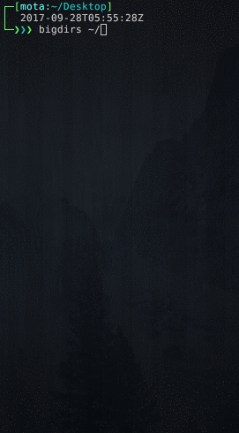

# bigdirs

> Bash script to find big directories

# Install

```bash
wget https://raw.githubusercontent.com/miguelmota/bigdirs/master/bigdirs.sh

mv bigdirs.sh /usr/local/bin/bigdirs
```

# Usage

```bash
$ bigdirs {path}
```

# Example

```bash
$ bigdirs ~/
```



# License

MIT
