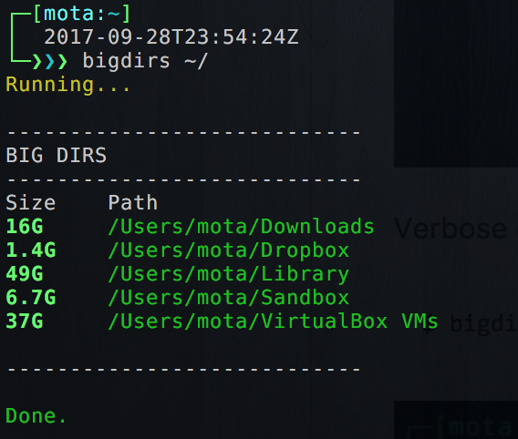
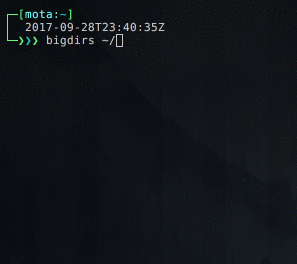
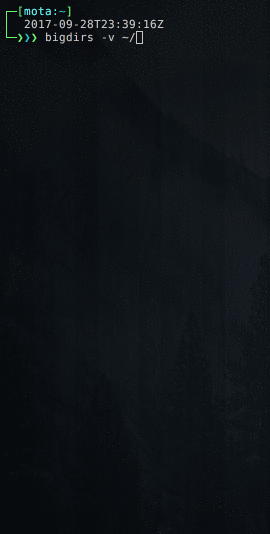
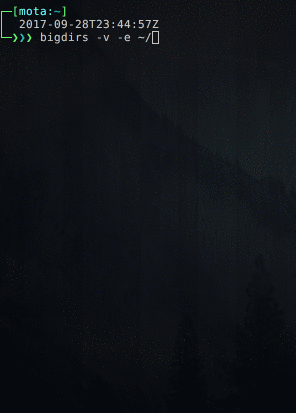

# bigdirs

> Bash script to find big directories (>1GB).



## Dependencies

- `realpath`
  - Ubuntu
    ```
    apt-get install realpath
    ```
  - macOS
    ```
    brew install coreutils
    ```

## Install

```bash
wget https://raw.githubusercontent.com/miguelmota/bigdirs/master/bigdirs.sh
chmod +x bigdirs.sh
sudo mv bigdirs.sh /usr/local/bin/bigdirs
```

## Usage

```bash
$ bigdirs [flags] {path}
```

## Example

Standard example

```bash
$ bigdirs ~/
```



Verbose example

```bash
$ bigdirs -v ~/
```



Verbose and exhaustive example (shows all big directories recursively)

```bash
$ bigdirs -v -e ~/
```



# FAQ

- Q: I'm getting a `Permission denied` error!

  - A: Try running as root user with `sudo` to scan permission restricted directories.

## License

MIT
